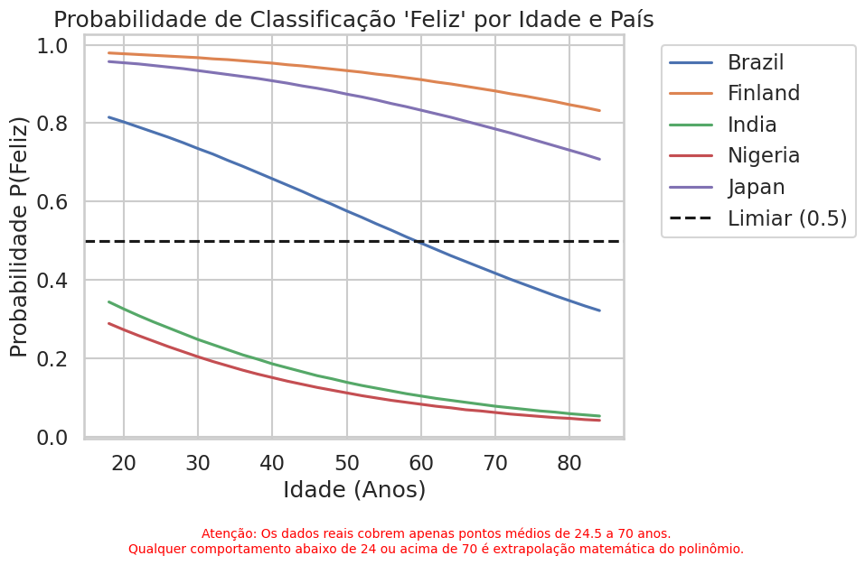

# World Happiness Regression: Predição de Bem-Estar Global
## Autores
- Daniel: [github.com/DanielTelesdeOliveira](https://github.com/DanielTelesdeOliveira)
- João Victor: [github.com/JTSoares](https://github.com/JTSoares)

### Objetivo 
Este projeto tem como objetivo analisar a relação entre a idade, as condições socioeconómicas e a perceção de bem-estar em mais de 140 países. Através da construção de um pipeline de dados ponta a ponta e da aplicação de modelos de Machine Learning (Regressão Linear e Logística), o estudo testa a validade estatística da famosa "curva em U" da felicidade e modela a probabilidade de satisfação com a vida combinando dados do World Happiness Report com indicadores da API do Banco Mundial.

### Como executar
Para replicar este ambiente de desenvolvimento e executar a modelagem localmente, é necessário o uso do Python 3.13 ou superior. Clone o repositório e instale as bibliotecas requeridas executando o comando abaixo na raiz do projeto:

`pip install -r requirements.txt`

Abra o arquivo do notebook e garanta uma execução limpa navegando pelo menu em Kernel → Restart & Run All.

### Principais resultados

Os resultados demonstram que os indicadores macroeconômicos, com destaque para o logaritmo do PIB per capita, atuam como um fator estrutural que define o patamar basal de probabilidade de um país ser classificado como feliz na Escada de Cantril. Ao isolar a variável idade nos classificadores, nota-se que a clássica hipótese da "curva em U" perde sustentação estatística. O modelo logístico capturou uma tendência de queda contínua na satisfação com a vida à medida que a idade avança, já que o termo quadrático (age_sq) não obteve ganho preditivo suficiente para confirmar uma recuperação clara do bem-estar na velhice dentro da amostra global analisada.

### Limitações do Modelo
A estrutura do conjunto de dados impõe uma simplificação severa da realidade socioeconômica. Como as variáveis de controle (PIB per capita, tamanho da população e área territorial) são fornecidas de forma agregada por nação, as quatro faixas etárias de um mesmo país recebem valores idênticos para essas características. O modelo é cego para a desigualdade de renda interna ou para disparidades de custo de vida entre gerações, assumindo falaciosamente que a riqueza nacional beneficia de forma homogênea tanto os jovens com menos de 30 anos quanto a população acima de 60 anos.

### Fontes
- [Gallup: World Happiness Report](https://www.gallup.com/analytics/349487/world-happiness-report.aspx)
- [WEF: At what age does happiness peak?](https://www.weforum.org/stories/wellbeing-and-mental-health/at-what-age-does-happiness-peak/)
- [WHR 2024: Happiness and age (resumo)](https://www.worldhappiness.report/ed/2024/happiness-and-age-summary/)
- [WHR 2024: Happiness of the younger, the older, and those in between](https://www.worldhappiness.report/ed/2024/happiness-of-the-younger-the-older-and-those-in-between/)
- [Our World in Data: Self-reported life satisfaction by age](https://ourworldindata.org/grapher/cantril-ladder-age-groups?tab=table)
- [The Happiness Curve (Macmillan)](https://us.macmillan.com/books/9781427292988/thehappinesscurve/)

### Fontes de Dados
- GALLUP; OXFORD WELLBEING RESEARCH CENTRE; UN SUSTAINABLE DEVELOPMENT SOLUTIONS NETWORK. World Happiness Report. Data Figure 2.1. Disponível em: https://files.worldhappiness.report/WHR26_Data_Figure_2.1.xlsx. Acesso em: 22 set. 2026.   
IPYNB

- OUR WORLD IN DATA. Self-reported life satisfaction by age. Disponível em: https://ourworldindata.org/grapher/cantril-ladder-age-groups.csv. Acesso em: 22 set. 2026.   
IPYNB

- WORLD BANK GROUP. World Bank Open Data. Indicadores NY.GDP.PCAP.PP.KD, SP.POP.TOTL e AG.LND.TOTL.K2. Washington, DC. Acesso via API pública em: 22 set. 2026.   

